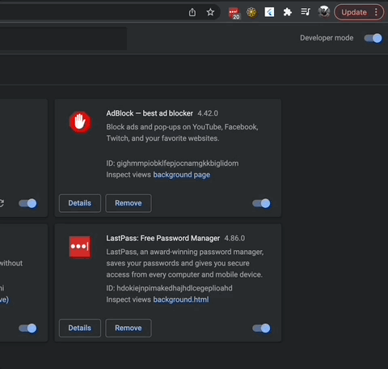

# chrome_extension

A starter repo for building Chrome extensions with Flutter. To walkthrough adding support for a Chrome extension to a Flutter app, check out [our guide](https://blog.pollyn.app/posts/2022-01-18-flutter-chrome-extension/){:target="_blank"}.

### Build

```bash
git clone git@github.com:danReynolds/chrome_extension.git
cd chrome_extension
flutter build web --csp --web-renderer html
```

### Run

Navigate to `chrome://extensions` and click load unpacked.

Select your project's `build/web` folder and then pin the extension to your browser toolbar. Click the popup and it will open and run.

.

## Customize

* Customize the `manifest.json` with your extension's name, description and other requirements. You can check out the manifest API on [Google's documentation](https://developer.chrome.com/docs/extensions/reference/).

* To change the size of the extension, configure the `html` rule in the `flutter.css` file.

* To change the application, open up the `lib` folder like a typical Flutter app and start coding! Rebuild your app after each change and reload the unpacked build folder at `chrome://extensions`.

## Releasing

The Chrome developer store requires your application to be zipped:

```bash
cd build/web
zip -r extension.zip .
cd ../..
mv build/web/extension.zip .
```

## Happy coding!

If you have issues or suggestions on how to make this sample repo better, let us know!
